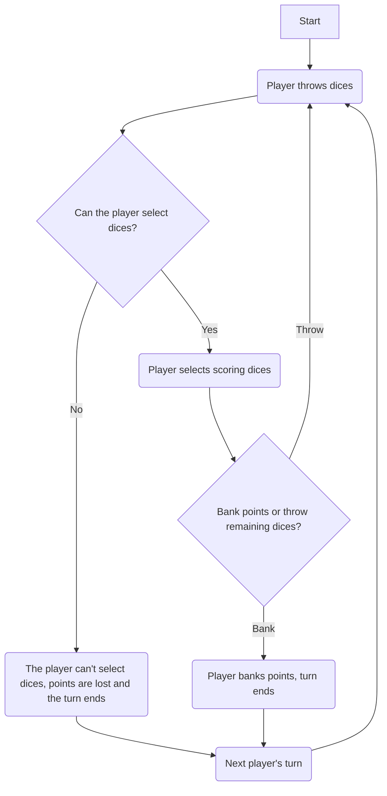

# Dice
Based on the dice game of Farkle. The goal of the player is to be first to reach a certain number of points. The game is played with six dices and the players alternate turns.

## Scoring
- A single `1` is worth 100 points
- A single `5` is worth 50 points
- Three of a kind is worth 100 points multiplied by the given number (e.g. 3x `4` is 400 points)
- Four of a kind or more is worth double the points of three of a kind (e.g. 4x `4` are worth 800 points, 5x `4` are worth 1,600 points)
- Three `1`s is worth 1,000 points
- Full straight (`1`-`6`) is worth 1,500 points
- Partial straight (`1`-`5`) is worth 500 points
- Partial straight (`2`-`6`) is worth 750 points

## Game Loop
This diagram shows a simplified game loop:

## References
- [Kingdom Come Deliverance Game Codex](https://kingdomcomecodex.github.io/?entry=ui_tutorial_name_dice)
- [Farkle on Wikipedia](https://en.wikipedia.org/wiki/Farkle)